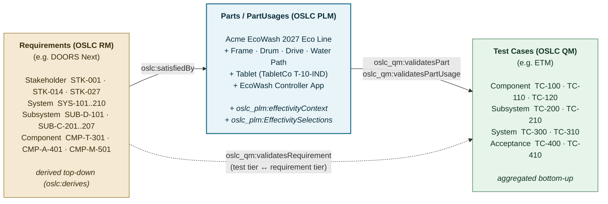
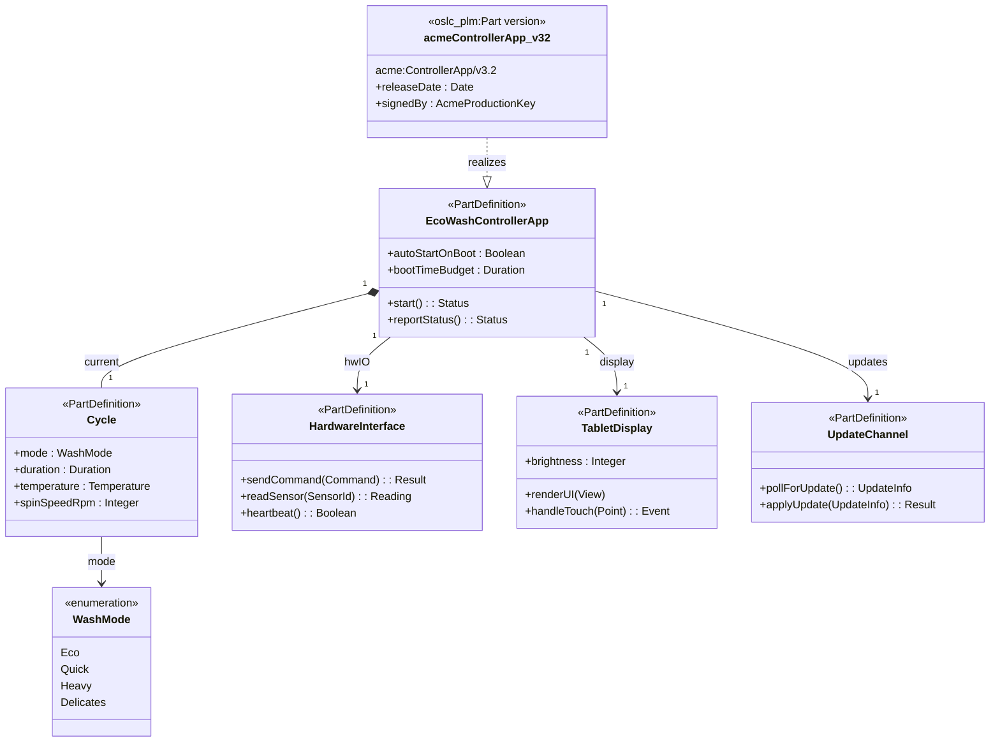

# Acme EcoWash: a digital-thread example across Teamcenter, OSLC PLM, and CDCM

*This document expands the small washing machine example in `plm-spec.html` into a complete V-model digital thread, then shows four different ways the same product can be instantiated in different OSLC and PLM environments. The point is to make the abstract differences in the existing mapping documents (`oslc-cm-sysml-teamcenter.md`, `oslc-teamcenter-plm-mapping.md`) concrete enough to argue about.*

*Variability is deferred. The example exercises versions and effectivity only.*

## At a glance — how OSLC, PLM, and CDCM fit together

For a stakeholder familiar with OSLC and PLM separately but not with how they integrate, the take-aways are these three.

### 1. Teamcenter PLM integrates three concerns OSLC deliberately keeps separate

| Teamcenter does this in one object graph… | …which the OSLC mapping unbundles |
|---|---|
| **Definition** — *what kind of part is this?* (Item, ItemRevision) | A linkable, versioned domain resource (`oslc_plm:Part`, profiled on `oslc_am:Resource`) |
| **Structure** — *how do parts compose?* (BOM line, BVR) | A linkable, versioned domain resource (`oslc_plm:PartUsage`, profiled on `oslc_am:Resource`) |
| **Selection** — *which versions are effective for which configuration, in which variant?* (Revision Rule + Effectivity Cursor + Variant Rule, applied in-session) | An explicit, externally referenceable selector (`oslc_config:Configuration` + `oslc_config:Selections`, extended with `oslc_plm:EffectivitySelections` and `oslc:VariabilitySelections`) |

Selection has three orthogonal axes — **version, effectivity, variability** — that Teamcenter computes through an intensional rule overlay at navigation time. OSLC turns each axis into a separate, explicit selections resource attached to a Configuration; the configuration itself is a URL another tool can use to set its Configuration-Context.

### 2. The recommended mapping spreads the digital thread across the OSLC domains, each owning what it can resolve

| OSLC domain | Role in the thread | Canonical resource | Typical tools |
|---|---|---|---|
| **OSLC Requirements Management** | Stakeholder → System → Subsystem → Component requirements (V-model left) | `oslc_rm:Requirement` | DOORS Next, Polarion |
| **OSLC Architecture Management** | System architecture and behaviour — UML and **SysML v2** model elements all surface here | `oslc_am:Resource` | Cameo, Capella, MagicDraw, Rhapsody, SysML v2 modeller |
| **OSLC PLM** (this spec) | Parts, PartUsages, effectivity-bound BOM resolution | `oslc_plm:Part`, `oslc_plm:PartUsage`, `oslc_plm:EffectivitySelections` | Windchill, Teamcenter, Aras Innovator (via adapters); native OSLC PLM providers |
| **OSLC Quality Management** | Test cases verifying requirements and parts (V-model right) | `oslc_qm:TestCase` | ETM, Polarion, Octane |
| **OSLC Change Management** | Change requests that drive transitions between versions of the resources above (not versioned themselves; associated with release iterations) | `oslc_cm:ChangeRequest` | EWM, Jira, ServiceNow |
| **OSLC Configuration Management** | The cross-domain selector — version-axis selection of versioned domain resources | `oslc_config:Configuration`, `oslc_config:Selections` | ELM GCM, MID CDCM |
| **OSLC Variability** (core extension) | Variant-axis selection — option choices selecting variant-conditional content | `oslc:VariabilitySelections`, `oslc:variabilityContext` | New: Any OSLC provider that resolves variants |
| **OSLC PLM** (effectivity extension) | Effectivity-axis selection — date / unit / serial / lot / end-item | `oslc_plm:EffectivitySelections`, `oslc_plm:effectivityContext` | New: OSLC PLM providers |

Cross-domain link properties (`oslc:satisfiedBy`, `oslc_qm:validatesPart`, `oslc_qm:validatesRequirement`, `oslc_am:realizes`, `oslc_cm:affectsPart`, …) wire the V-model traceability across these resources. The placement principle is simple: **a selection type is owned by the specification responsible for resolving it.** Core owns variability because every provider can compute a variant selection; PLM owns effectivity because only a PLM-capable provider can resolve date / unit / serial / lot / end-item semantics; Configuration Management owns the version axis it has always covered.

### 3. CDCM is the organizational layer on top — not a PLM, not a competitor

MID Cross Domain Configuration Management (CDCM) is **not** a PLM system. It is an organizational front-end on top of OSLC Configuration Management:

- It is a conformant OSLC Configuration Management Global Configuration provider — it composes contributions from multiple applications into a single Global Configuration, using the standard OSLC Configuration Management protocols (it can act as the Global Configuration provider for an ELM deployment, for instance).
- It adds typed Configuration Items (with properties, lifecycle, authorization, editor views) for organizational artefacts — CAD / ECAD drawings, vendor datasheets, regulatory compliance documents, service manuals — that the engineering authoring tools do not naturally model as domain resources.
- It **aggregates** external contributions (an OSLC PLM Baseline, a DOORS Next RM local configuration, an ETM QM local configuration, a Jira CR list, a SysML AM local configuration) into a single Global Configuration that downstream consumers pin to.

The three roles compose, and a realistic enterprise digital thread typically uses all three:

1. **Domain resource providers** (RM, QM, AM, CM) own their content.
2. **OSLC PLM** owns the part / BOM data and effectivity-bound BOM resolution.
3. **CDCM** aggregates everything into one Global Configuration and provides the document-rich organizational governance that the authoring tools do not.

The four instantiations in §2 – §5 below show the same Acme EcoWash washing machine in each of these arrangements: Teamcenter alone, OSLC PLM + OSLC Configuration Management, CDCM alone, and the recommended hybrid where each tool plays the role it is best at.

---

## 1. The product — Acme EcoWash 2027 Eco Line

Acme Appliances designs and ships a residential washing machine, the **EcoWash 2027 Eco Line**. The washing machine is configured by Acme but uses several third-party parts, the most architecturally interesting of which is an **OEM Android tablet from TabletCo** that serves as the machine's user interface and control computer. Acme does not design the tablet; TabletCo does. Acme writes a custom Android application — the **EcoWash Controller App** — that auto-starts as the tablet boots and is the only user-visible UI on the device.

This composition pattern is the realistic case: a vendor's product is mostly its own design, but with a critical subsystem sourced from another organization whose internal BOM the vendor does not see. The third-party part is a single opaque Part from Acme's perspective, and Acme bundles its own software with it. Both the tablet hardware revision and the bundled software revision evolve on their own timelines; the digital thread must express both, and must express which combinations are effective at which dates.

### 1.1 Product structure

```
Acme EcoWash 2027 Eco Line
├── Frame
│   ├── Upper Housing       (Acme MCAD: 3D model, drawings)
│   └── Lower Housing       (Acme MCAD: 3D model, drawings)
├── Drum Assembly
│   ├── Drum                (Acme MCAD)
│   └── Bearing             (sourced from BearingCo; opaque Part)
├── Drive System
│   ├── Motor               (sourced from MotorCo; opaque Part)
│   ├── Belt
│   └── Pulley
├── Water Path
│   ├── Inlet Valve         (sourced; opaque)
│   ├── Drain Pump          (sourced; opaque)
│   └── Hose Set            (Acme ECAD/MCAD: routing diagrams, dimensions)
└── Control System
    ├── Tablet              (OEM TabletCo T-10-IND; opaque Part; Acme records the model and rev)
    ├── Tablet Mount Bracket (Acme MCAD)
    ├── EcoWash Controller App (Acme software; auto-starts on tablet boot)
    └── Wiring Harness      (Acme ECAD: schematic, connector list, wire list)
```

The vendor-sourced parts (Motor, Bearing, Inlet Valve, Drain Pump, Tablet) have their own BOMs at their respective vendors. Those internal BOMs are **out of scope** for Acme: from Acme's PLM perspective each is a single Part with a part number, a vendor reference, and a revision identifier that tracks the vendor's revision.

### 1.2 The Tablet specifically

- **Vendor**: TabletCo
- **Model**: `T-10-IND` (Industrial 10.1" Android Tablet)
- **Tablet hardware revisions visible to Acme**: rev A (2026-Q3), rev B (2027-Q2). TabletCo communicates rev changes; Acme records each as a Part version with the vendor revision identifier and validation status.
- **Acme part number for the tablet**: `ACME-CTRL-TAB-001`
- **EcoWash Controller App** (Acme-owned): versions `v3.0`, `v3.1`, `v3.2`, …, each compiled against a specific Android API level. Versions of the app are compatible with specific Tablet hardware revs and specific Android versions on the tablet image.

The composition Acme cares about: which (Tablet hardware rev) × (App version) × (Android image rev) combinations are effective for which date ranges of EcoWash 2027 production. This is the most variability-rich part of the BOM and the easiest place to demonstrate effectivity.

### 1.3 Versions and effectivity timeline (excerpt)

| Part / PartUsage | Version | Effective |
|---|---|---|
| `Motor` | V12.8 | until 2027-06-30 |
| `Motor` | V12.9 | from 2027-07-01 |
| `Housing` | V4.2 | 2027-01-01 to 2027-12-31 |
| `Housing` | V4.3 | 2028-01-01 to 2028-06-30 |
| `Tablet` | T-10-IND rev A | until 2027-04-30 |
| `Tablet` | T-10-IND rev B | from 2027-05-01 |
| `EcoWash Controller App` | v3.1 | 2027-01-01 to 2027-06-30 |
| `EcoWash Controller App` | v3.2 | from 2027-07-01 |

Real production tables are larger; this is enough to drive worked resolution scenarios below.

### 1.4 Requirements (V-model — left side, top to bottom)

The Acme requirements cascade is captured in a Requirements Management tool (DOORS Next in this example):

- **Stakeholder (market) requirements** — `STK-001` "Wash 8kg of laundry in under 2 hours using less than 0.5 kWh per cycle in Eco mode"; `STK-014` "Operate from a single tablet-style touchscreen UI"; `STK-027` "Provide field-updatable firmware for the controller".
- **System requirements** — `SYS-101` "Drum capacity ≥ 8kg"; `SYS-103` "Eco-mode cycle time ≤ 120 min"; `SYS-107` "Power consumption ≤ 500 Wh/Eco-cycle"; `SYS-201` "Single-point UI through a touchscreen tablet running Android 12+"; `SYS-203` "Controller responds to user input within 200 ms"; `SYS-210` "Controller software shall auto-start on tablet boot and survive crash/restart".
- **Subsystem requirements** —
  - Drive system: `SUB-D-101` "Motor delivers ≥ 8 Nm torque at 1400 rpm under load"; `SUB-D-104` "Drive belt slip ≤ 0.5%".
  - Control system: `SUB-C-201` "Tablet meets TabletCo industrial specification I-10-2026"; `SUB-C-203` "EcoWash Controller App targets Android API ≥ 33"; `SUB-C-207` "App boots within 8 s from power-on".
- **Component requirements** —
  - `CMP-T-301` "Tablet shall be TabletCo T-10-IND rev A or later"; `CMP-T-303` "Tablet image shall be Android 12 build TC-12.4.1 or later".
  - `CMP-A-401` "EcoWash Controller App ≥ v3.1, signed with Acme production key".
  - `CMP-M-501` "Motor shall be MotorCo M-87 rev V12.8 (until 2027-06-30) or rev V12.9 (from 2027-07-01)".

### 1.5 Test cases (V-model — right side, bottom to top)

Test cases live in a Test Management tool (ETM in this example):

- **Component tests** — `TC-100` (Motor torque under load); `TC-110` (Tablet image boot time on rev A and rev B); `TC-120` (Controller App fresh-install on Tablet rev B / Android 12).
- **Subsystem tests** — `TC-200` (Drive system integrated motor + belt + drum spin-up); `TC-210` (Control system: app auto-starts on power-cycle, UI responsive within 200 ms).
- **System tests** — `TC-300` (Full Eco cycle: 8 kg load, complete < 120 min, < 500 Wh); `TC-310` (Field firmware update of Controller App through Acme's update channel).
- **Acceptance tests** — `TC-400` (UL listing tests); `TC-410` (CE marking electromagnetic compatibility).

Each test case is authored against one or more requirement IDs (`oslc_qm:validatesRequirement`), and the tests are run against specific Part revisions captured in a test campaign.

### 1.6 The whole digital thread

The V-model digital thread for the EcoWash example spans three OSLC domains (Requirements Management, Product Lifecycle Management, Quality Management) plus the optional Architecture Management contribution shown in §1.7. The diagram below shows the three core domains as boxes with their V-model tiers listed inside; the labelled arrows are the OSLC cross-domain link properties.



The V-model relationships in plain English:

- **Within each requirement tier** the requirements derive downward (Stakeholder → System → Subsystem → Component) via `oslc:derives` / `oslc:elaborates`.
- **Within each test tier** the test cases aggregate upward (Component → Subsystem → System → Acceptance) — i.e. higher-level tests are implemented by, or composed of, lower-level tests.
- **At the bottom of the V** Component requirements specify what the Parts must do (`oslc:satisfiedBy`); Parts are exercised by Component tests (`oslc_qm:validatesPart`). This is where the design is realized and verified.
- **At each tier** a test of that tier validates a requirement of the same tier (`oslc_qm:validatesRequirement`) — Acceptance tests validate Stakeholder requirements, System tests validate System requirements, and so on.

Cross-domain link properties used above (and elsewhere in the example):

- **Requirement → Part**: `oslc:satisfies` (Part satisfies the requirement) or the inverse `oslc:satisfiedBy`. Per the [OSLC PLM extension](../plm-spec.html), `oslc_am:realizes` may also be carried by an AM-side architecture element pointing at the Part it realizes.
- **Test case → Requirement**: `oslc_qm:validatesRequirement`.
- **Test case → Part**: `oslc_qm:validatesPart` / `oslc_qm:validatesPartUsage`.
- **Change request → Part / Requirement / Test case**: `oslc_cm:affectsPart`, `oslc_cm:affectsRequirement`, `oslc_cm:affectsTestCase` — not drawn in the diagram to keep it readable, but exercised in §3.3.

The whole thread also needs a **configuration context** that pins which revisions are in play. The four instantiations below differ primarily in how that configuration context is expressed.

### 1.7 SysML v2 model of the EcoWash Controller App

When the digital thread also spans an architecture-modelling layer, SysML v2 elements appear in the OSLC layer as `oslc_am:Resource` instances (per the OASIS OSLC SysML v2 vocabulary) and become candidate targets of a *realize* link from the concrete PLM Part that implements them. The Controller App is the cleanest example in this product: its system specification — which cycles it manages, what hardware interfaces it expects, what UI it renders, what option enumerations it understands — is naturally a SysML model, and the concrete shipped software product is a PLM Part with versions.

The following class diagram is a small SysML v2 model of the Controller App. Each `PartDefinition` is exposed as an `oslc_am:Resource`. The `oslc_plm:Part` version `acme:ControllerApp/v3.2` realizes the top-level `EcoWashControllerApp` PartDefinition — this is the concrete-realizes-specification direction, where the PLM Part is the realizer and the SysML PartDefinition is the specification being realized.



Notes on this model and its place in the thread:

1. **Each SysML `PartDefinition` is an `oslc_am:Resource`.** They are linkable, versioned (via OSLC AM's concept/version split), and participate in OSLC configurations like any other AM resource.
2. **The realize link direction** in this example is *concrete → specification*: an `oslc_plm:Part` version realizes a SysML PartDefinition. This reads "the Acme Controller App v3.2 *implements* the architectural specification expressed by `EcoWashControllerApp`." It matches UML's standard "implementation realizes specification" reading and ARCADIA's "physical realizes logical" reading. Note that this is the inverse direction from `oslc_am:realizes` as currently defined in `plm-spec.html` (where the AM resource is the realizer and a PLM Part is the target). Both directions are defensible — they describe the same relationship from opposite sides — and an actual deployment might use one, the other, or both as inverse properties. The example uses the PLM-side property to highlight that the PLM Part is the concrete artefact answering to a published architectural spec.
3. **What this closes in the digital thread.** With SysML/AM present, the V-model thread extends one more step: a system requirement (`SYS-210` "Controller software shall auto-start on tablet boot") `oslc:satisfiedBy` the SysML `EcoWashControllerApp` PartDefinition (via its `autoStartOnBoot` property and `start()` operation); the SysML PartDefinition is `oslc_plm:realizes`-d by `acme:ControllerApp/v3.2`; and the test case `TC-210` `oslc_qm:validatesRequirement` against `SYS-210` and `oslc_qm:validatesPart` against `acme:ControllerApp`. Every link is OSLC-native, and the SysML model can be configured (versioned, baselined) alongside the PLM Parts and the RM / QM resources in a single OSLC Configuration.
4. **Where the SysML model lives in the four instantiations below.** In Teamcenter (§2), SysML models typically live in a separate tool (Cameo, Capella, SysML v2 modeller) and are linked from Teamcenter via an OSLC AM adapter or a native trace link. In OSLC PLM + OSLC Configuration Management (§3), the model is contributed as an `oslc_am` local configuration to the same Global Configuration as the Parts and the RM / QM resources. In CDCM-only (§4), the SysML elements are wrapped as Configuration Items of a `SysML Model Element` type. In the hybrid (§5), they live in their native AM provider and are included as another contribution alongside the OSLC PLM Baseline.

---

## 2. Instantiation 1 — Teamcenter

Teamcenter is the integrated PLM environment. The example would be instantiated as:

### 2.1 Data-model translation

| Concept | Teamcenter representation |
|---|---|
| Acme EcoWash 2027 Eco Line | `Item` (assembly) with `item_id = ACME-WM-EW2027` |
| WashingMachine revisions | `ItemRevision` for each authoring iteration (e.g., A, B, C, D) |
| BOM | `BOMView` of the WashingMachine Item; `BOMViewRevision` per ItemRevision |
| Motor (from MotorCo) | `Item` with `make_buy = Buy`, `vendor_id = MotorCo`, `vendor_item_id = M-87`; ItemRevisions track vendor revs |
| Tablet (from TabletCo) | `Item` `ACME-CTRL-TAB-001`, `make_buy = Buy`, `vendor_id = TabletCo`, `vendor_item_id = T-10-IND`; ItemRevisions track rev A, rev B |
| EcoWash Controller App | `Item` (software type); ItemRevisions for v3.0, v3.1, v3.2 |
| Housing, Drum, etc. | Acme-owned `Item` and `ItemRevision`s |
| BOM line / occurrence | `BOMView.bvr_id` child relationship with `find_no`, `quantity`, attached effectivity |
| Effectivity range | Effectivity objects on the BOM line (`WTDatedEffectivity` analogue: `start_date`, `end_date`, optional `end_item`); or revision-level effectivity on the ReleaseStatus |
| Selection at navigation time | `Revision Rule` (e.g., "Latest Working" / "Effective on 2027-09-01") + Effectivity Cursor |
| Requirements (`STK-*`, `SYS-*`, …) | Teamcenter Requirements Management items, or external Polarion/DOORS items linked via Teamcenter Trace Link |
| Test cases (`TC-*`) | Teamcenter Test Management items, or external Polarion/ETM linked via Trace Link |
| Cross-domain links | Native Teamcenter Trace Links (Item ↔ Requirement; Test ↔ Item) or OSLC adapter links to external tools |

### 2.2 Resolving "the BOM as of 2027-09-01"

A consumer asks for the configured BOM by:

1. Selecting the WashingMachine ItemRevision (typically "latest" via the Revision Rule).
2. Setting the Revision Rule's Effectivity Cursor to date = 2027-09-01.
3. Optionally selecting a Variant Rule (none in this example — variability deferred).
4. Expanding the BOMView Revision.

Teamcenter applies the rule + cursor at traversal time. For each BOM line, the effectivity range is matched against the cursor: BOM lines with effective ranges that include 2027-09-01 survive; others are filtered. The materialized BOM contains:

- Motor V12.9 (effective from 2027-07-01)
- Housing V4.2 (effective 2027-01-01 to 2027-12-31)
- Tablet T-10-IND rev B (effective from 2027-05-01)
- EcoWash Controller App v3.2 (effective from 2027-07-01)
- All other Acme parts at their currently-effective revisions

### 2.3 Where the conflation shows up

The selection rule (Revision Rule + Effectivity Cursor) and the effectivity data (ranges on BOM lines) are not separately addressable as resources. The user picks them through a session/context overlay; the configured BOM is materialized on demand. Requirements and tests are linked to ItemRevisions through Teamcenter Trace Links, which are first-class but are still Teamcenter-internal — exposing them outside Teamcenter requires an OSLC adapter that produces `oslc_rm:Requirement` / `oslc_qm:TestCase` representations, plus a way to externalize the configuration context. Teamcenter's strength here is the integration; its weakness for the cross-tool digital thread is that none of the selector parts are separate resources.

### 2.4 What's captured, what isn't

- **Captured natively**: Parts, BOMs, BOM-line effectivity, Revision Rules, internal trace links, the third-party Tablet as a `make_buy = Buy` Item with vendor reference.
- **External**: TabletCo's internal BOM (not visible to Acme; the Item carries only the vendor reference). The Acme Controller App's code-management lineage (Git history) lives in a separate SCM with at most a metadata link from the Item.
- **Requires an adapter to externalize**: the configuration context (Revision Rule + cursor) for cross-tool consumers; cross-tool trace links to non-Teamcenter requirements or tests.

---

## 3. Instantiation 2 — OSLC PLM (extended) with OSLC Configuration Management

This is the model proposed in the OSLC PLM specification under refinement in this project, with the extensions for `oslc_plm:EffectivitySelections` and `oslc_plm:effectivityContext`. Variability would use `oslc:VariabilitySelections` from the OSLC Variability specification but is deferred for this example.

### 3.1 Data-model translation

| Concept | OSLC representation |
|---|---|
| Acme EcoWash 2027 Eco Line | `oslc_plm:Part` (concept resource) `acme:WashingMachine` |
| WashingMachine revisions | Part version resources (`oslc_config:VersionResource`): `acme:WashingMachine/v2027`, `acme:WashingMachine/v2028` |
| BOM structure | `oslc_plm:PartUsage` resources reifying each parent→child usage |
| Motor / Housing / Drum etc. | Acme-owned `oslc_plm:Part` instances; each Part has version resources |
| Tablet | `oslc_plm:Part` `acme:Tablet` with `dcterms:identifier = "ACME-CTRL-TAB-001"`, `oslc:publisher` pointing at TabletCo, `acme:vendorModel = "T-10-IND"`. Versions: `acme:Tablet/revA`, `acme:Tablet/revB` |
| EcoWash Controller App | `oslc_plm:Part` `acme:ControllerApp`. Versions: `acme:ControllerApp/v3.1`, `acme:ControllerApp/v3.2` |
| BOM line / occurrence | `oslc_plm:PartUsage` version resources; each carries `oslc_plm:effectivity` records |
| Effectivity range | `oslc_plm:Effectivity` records on PartUsage versions, with `effectiveFrom` / `effectiveTo` / `effectiveValueType oslc_plm:Date` |
| Selection at request time | `oslc_config:Stream` or `oslc_config:Baseline` with `oslc_plm:effectivityContext` property and `oslc_plm:EffectivitySelections` containing post-filter `selects` |
| Requirements | `oslc_rm:Requirement` resources |
| Test cases | `oslc_qm:TestCase` resources |
| Cross-domain links | Domain link properties (`oslc:satisfies`, `oslc_qm:validatesRequirement`, `oslc_qm:validatesPart`, `oslc_am:realizes`) — see [PLM spec Constraints on Other OSLC Domain Resources](../plm-spec.html#otherConstraints) |

### 3.2 RDF sketch (Turtle, abbreviated)

```turtle
@prefix oslc:        <http://open-services.net/ns/core#> .
@prefix oslc_am:     <http://open-services.net/ns/am#> .
@prefix oslc_cm:     <http://open-services.net/ns/cm#> .
@prefix oslc_qm:     <http://open-services.net/ns/qm#> .
@prefix oslc_rm:     <http://open-services.net/ns/rm#> .
@prefix oslc_config: <http://open-services.net/ns/config#> .
@prefix oslc_plm:    <http://open-services.net/ns/plm#> .
@prefix dcterms:     <http://purl.org/dc/terms/> .
@prefix xsd:         <http://www.w3.org/2001/XMLSchema#> .
@prefix acme:        <https://plm.acme.example/ecowash/> .

# Parts (master / concept resources)
acme:WashingMachine    a oslc_plm:Part ; dcterms:title "Acme EcoWash 2027 Eco Line" .
acme:Motor             a oslc_plm:Part ; dcterms:title "Motor (MotorCo M-87)" .
acme:Housing           a oslc_plm:Part ; dcterms:title "Housing" .
acme:Tablet            a oslc_plm:Part ;
    dcterms:title "Tablet (TabletCo T-10-IND)" ;
    dcterms:identifier "ACME-CTRL-TAB-001" ;
    oslc:publisher <https://tabletco.example/> .
acme:ControllerApp     a oslc_plm:Part ; dcterms:title "EcoWash Controller App" .

# Part-level composition (concept → concept via PartUsage)
acme:WashingMachine oslc_plm:composedOfPartUsage
    acme:Usage_WM_Motor , acme:Usage_WM_Housing , acme:Usage_WM_Tablet , acme:Usage_WM_App , … .

acme:Usage_WM_Tablet a oslc_plm:PartUsage ; oslc_plm:representsPart acme:Tablet .
acme:Usage_WM_App    a oslc_plm:PartUsage ; oslc_plm:representsPart acme:ControllerApp .

# Tablet PartUsage versions — each pins a child Tablet revision and carries effectivity
acme:Usage_WM_Tablet_revA a oslc_config:VersionResource , oslc_plm:PartUsage ;
    oslc_plm:effectivity [
        a oslc_plm:Effectivity ;
        oslc_plm:effectiveValueType oslc_plm:Date ;
        oslc_plm:effectiveTo "2027-04-30"^^xsd:date
    ] .

acme:Usage_WM_Tablet_revB a oslc_config:VersionResource , oslc_plm:PartUsage ;
    oslc_plm:effectivity [
        a oslc_plm:Effectivity ;
        oslc_plm:effectiveValueType oslc_plm:Date ;
        oslc_plm:effectiveFrom "2027-05-01"^^xsd:date
    ] .

# App PartUsage versions
acme:Usage_WM_App_v3-1 a oslc_config:VersionResource , oslc_plm:PartUsage ;
    oslc_plm:effectivity [
        a oslc_plm:Effectivity ;
        oslc_plm:effectiveValueType oslc_plm:Date ;
        oslc_plm:effectiveFrom "2027-01-01"^^xsd:date ;
        oslc_plm:effectiveTo "2027-06-30"^^xsd:date
    ] .

acme:Usage_WM_App_v3-2 a oslc_config:VersionResource , oslc_plm:PartUsage ;
    oslc_plm:effectivity [
        a oslc_plm:Effectivity ;
        oslc_plm:effectiveValueType oslc_plm:Date ;
        oslc_plm:effectiveFrom "2027-07-01"^^xsd:date
    ] .

# A stream with attached effectivity context
acme:Stream_EW2027 a oslc_config:Stream ;
    dcterms:title "EcoWash 2027 — engineering stream" ;
    oslc_config:component         acme:WashingMachine ;
    oslc_plm:effectivityContext   acme:Ctx_2027_09_01 ;
    oslc_config:selections        acme:Selections_2027_09_01 .

acme:Ctx_2027_09_01 a oslc_plm:EffectivityContext ;
    oslc_plm:effectivityDate "2027-09-01"^^xsd:date .

# The post-filter EffectivitySelections — server-maintained on the stream
acme:Selections_2027_09_01 a oslc_plm:EffectivitySelections ;
    oslc_config:selects
        acme:Usage_WM_Motor_27on ,         # Motor V12.9 (from 2027-07-01) — effective ✓
        acme:Usage_WM_Housing_2027 ,       # Housing V4.2 (2027 year) — effective ✓
        acme:Usage_WM_Tablet_revB ,        # Tablet rev B (from 2027-05-01) — effective ✓
        acme:Usage_WM_App_v3-2 .           # App v3.2 (from 2027-07-01) — effective ✓
        # PartUsage versions whose effectivity excludes 2027-09-01 are NOT in selects.

# A baseline taken at this snapshot freezes both the selects and the context
acme:Baseline_EW2027_Sept a oslc_config:Baseline ;
    oslc_config:baselineOfStream  acme:Stream_EW2027 ;
    oslc_plm:effectivityContext   acme:Ctx_2027_09_01 ;          # frozen
    oslc_config:selections        acme:Selections_2027_09_01 .   # frozen
```

### 3.3 The V-model traces

```turtle
# A System requirement is satisfied by the controller subsystem of a Part version
<urn:doors:SYS-203> a oslc_rm:Requirement ;
    dcterms:title "Controller responds to user input within 200 ms" ;
    oslc:satisfiedBy acme:Usage_WM_App_v3-2 .

# A Test case validates that requirement and a specific Part version
<urn:etm:TC-210> a oslc_qm:TestCase ;
    dcterms:title "Control system responsiveness under load" ;
    oslc_qm:validatesRequirement <urn:doors:SYS-203> ;
    oslc_qm:validatesPart        acme:ControllerApp ;
    oslc_qm:validatesPartUsage   acme:Usage_WM_App_v3-2 .

# Change requests can affect any of the above
<urn:ccm:CR-4711> a oslc_cm:ChangeRequest ;
    dcterms:title "Boot-time regression observed in App v3.1" ;
    oslc_cm:affectsPartUsage  acme:Usage_WM_App_v3-1 ;
    oslc_cm:affectsRequirement <urn:doors:SYS-210> ;
    oslc_cm:affectsTestCase   <urn:etm:TC-210> .
```

### 3.4 How resolution works

A consumer wanting "the BOM as of 2027-09-01 with linked requirements and tests":

1. Reads `acme:Stream_EW2027`. Sees `oslc_plm:effectivityContext = acme:Ctx_2027_09_01` and `oslc_config:selections = acme:Selections_2027_09_01`.
2. Fetches `acme:Selections_2027_09_01` (an `oslc_plm:EffectivitySelections`). Its `oslc_config:selects` triples are the post-filter PartUsage versions — already computed.
3. For each PartUsage version, follows `oslc_plm:representsPart` to find the child Part; for the Tablet, also fetches `oslc:publisher` and `acme:vendorModel` to see the vendor reference.
4. Follows `oslc:satisfiedBy`, `oslc_qm:validatesPart`, `oslc_qm:validatesPartUsage` to find linked Requirements and TestCases (these are in DOORS Next and ETM, each in their own OSLC server). Cross-domain links work because every party speaks OSLC.

For other tools to compose this PLM configuration with their own (DOORS Next requirements, ETM tests, SCM commits for the Controller App), a Global Configuration aggregates `acme:Baseline_EW2027_Sept` alongside RM and QM local configurations. See instantiation 4 below for that pattern.

### 3.5 What's captured, what isn't

- **Captured**: Parts, PartUsages, BOM structure, effectivity-bound PartUsage versions, the configuration context, the post-filter `selects` (Stream is server-maintained; Baseline is frozen), cross-domain links to Requirements / TestCases / ChangeRequests, the third-party Tablet as a Part with vendor reference.
- **External / out of scope**: TabletCo's internal BOM (Acme sees only the Part); the Acme Controller App's source code (lives in SCM with metadata link).
- **Cleanly externalized for cross-tool use**: the `Baseline` itself, with its frozen `effectivityContext` and `selects`, is a single URL that another tool can pin a Global Configuration to.

---

## 4. Instantiation 3 — CDCM only (everything as Configuration Items)

In this instantiation, Acme uses CDCM as the single configuration management system. There is no separate OSLC PLM provider. Every artifact — Parts, software, requirements, tests, MCAD / ECAD documents — is wrapped in a CDCM Configuration Item of an appropriate type, and the BOM structure is expressed as Contributions to Configurations.

### 4.1 Data-model translation

CDCM Configuration Items are typed; Acme defines Configuration Item Types in CDCM with properties, editor views, lifecycle, and authorization rules. For this example:

| Concept | CDCM representation |
|---|---|
| Acme EcoWash 2027 Eco Line | A top-level `Configuration` named "Acme EcoWash 2027 Eco Line"; each authoring snapshot is a `Baseline` of that Configuration |
| Subsystem hierarchies (Frame, Drive System, Control System) | Sub-Configurations contributed to the top-level Configuration |
| Each Part (Motor, Housing, Tablet, …) | A Configuration Item of type `Part`, with Acme-defined properties (part number, vendor, make/buy, lifecycle state) |
| Part revisions | **Not natively represented** — CDCM Configuration Items are not versioned. The Configuration that contains them is versioned; revisions are modelled either as separate Configuration Items per revision (e.g., `Motor-V12.8`, `Motor-V12.9` as distinct CIs) or by including a "revision" property and choosing which CI is contributed in each Baseline |
| BOM line / occurrence | A `Contribution` from a parent Configuration to a child Configuration Item (the contribution order on each parent Configuration defines BOM-line order) |
| MCAD / ECAD documents | Configuration Items of type `MCAD Document` / `ECAD Document` with file-attachment work products |
| EcoWash Controller App build | Configuration Item of type `Software Build` with metadata pointing at a Git tag (the source lives elsewhere) |
| Requirements / TestCases | Either (a) Configuration Items of types `Requirement` / `TestCase` wrapping external URLs, or (b) external resources contributed directly via foreign-URL Contributions to a configuration |
| Effectivity | **Not natively represented** — CDCM has no effectivity model. The closest substitute is one Baseline per "as-of" date, with the contribution graph for that baseline reflecting which CIs were effective at that moment |
| Selection | Purely structural: walking the Contribution tree depth-first by `orderId`, first-match-wins on duplicates |

### 4.2 Modelling effectivity in CDCM

Since CDCM has no native effectivity, Acme has two options:

1. **Date-tagged Baselines.** For every "as-of" date that matters, take a Baseline of the engineering Stream and name it accordingly: `EcoWash 2027 — as of 2027-09-01`. The Contribution tree of that Baseline literally enumerates the configuration items effective at that date. Pros: simple; pure-CDCM. Cons: the effectivity criterion is implicit in the baseline name; you cannot ask "as of 2027-09-01" without already having taken that baseline.
2. **External effectivity layer.** Run a thin selection layer on top of CDCM that interprets a property on each CI ("effective from", "effective to") and produces a filtered Contribution tree at query time. This is CDCM growing toward the OSLC PLM extensions, and at that point Acme should consider switching to the OSLC PLM model.

In practice CDCM customers using only CDCM tend to use option 1 because date-tagged baselines are sufficient for organizational use cases and avoid building a custom effectivity engine.

### 4.3 The V-model traces

V-model traces are expressed as Configuration Items of appropriate types (Requirement, TestCase) wrapping external URLs (DOORS Next requirement URIs, ETM test-case URIs). The traces themselves are not first-class in CDCM — they live as link properties on the wrapped resources, in the external tools. CDCM contributes the *configuration* of which requirement / test versions are in play; it does not express the trace links between them.

For the example: each STK / SYS / SUB / CMP requirement is a CDCM Configuration Item of type `Requirement` whose work product URL points at the DOORS Next requirement. Same for test cases. The Contribution tree of a Baseline includes all three (Parts, Requirements, TestCases) so the configuration is complete.

### 4.4 What's captured, what isn't

- **Captured**: the organization — every artifact has a known place in the CDCM hierarchy; baselines freeze that hierarchy; authorization, lifecycle, and editor views are uniform.
- **Lost relative to OSLC PLM**: structural relationships between Parts (no PartUsage reification — only Contribution; PartUsage versioning that lets a usage carry its own effectivity is impossible without versioned CIs); native effectivity (substituted by date-tagged Baselines, which is workable but coarse); cross-domain trace links as first-class resources (CDCM wraps external resources but does not own the links between them).
- **Lost relative to Teamcenter**: rule-based intensional selection (no Revision Rules; CDCM is purely extensional); rich domain-specific part structure (CDCM is generic; Teamcenter has a deep BOM model).

CDCM-only works well when the customer's primary need is *organizational governance* — knowing where every document and reference lives, having a single place to baseline a release, controlling access uniformly — and acceptably when the effectivity / versioning needs are simple. It does not work well when the customer needs to ask "what's effective on date X" without pre-creating a Baseline for that date.

---

## 5. Instantiation 4 — Hybrid (CDCM organizes; OSLC PLM owns the parts; OSLC Configuration Management for the effective BOM)

This is the recommended pattern for organizations that need both rich PLM (effectivity, part structure, BOM resolution) *and* rich organizational governance across many document and tool types. CDCM is the aggregator; OSLC PLM is the part-data system; OSLC Configuration Management is the lingua franca for cross-tool selection.

### 5.1 Division of responsibility

**Captured in OSLC PLM** (the part data and its effectivity-bound resolution):

- The washing machine itself: Parts, PartUsages, versions, BOM structure.
- Effectivity records on PartUsage versions.
- `oslc_plm:EffectivityContext` and `oslc_plm:EffectivitySelections` for the effective BOM.
- The Tablet as an `oslc_plm:Part` with vendor reference; Tablet revisions as Part versions.
- The EcoWash Controller App as an `oslc_plm:Part`; App versions as Part versions.

**Captured in CDCM** (organizational artefacts and the cross-domain composition):

- MCAD / ECAD / electrical drawings as Configuration Items of type `MCAD Document` etc.
- Stakeholder / System / Subsystem / Component requirements (as CIs wrapping DOORS Next URIs).
- Test cases (as CIs wrapping ETM URIs).
- TabletCo product documentation, datasheets, regulatory compliance documents.
- EcoWash Controller App release notes, security advisories.
- Service manuals, factory layouts, training materials.

### 5.2 Composition through Global Configuration

The single source of truth for "what's in the EcoWash 2027 as of 2027-09-01" is a Global Configuration *in CDCM* whose Contributions are:

1. The OSLC PLM `oslc_config:Baseline` `acme:Baseline_EW2027_Sept` (carrying the frozen `oslc_plm:effectivityContext` and `oslc_plm:EffectivitySelections.selects`). CDCM sees this as a foreign-URL contribution; it does not need to understand the new selection subclasses — they flow through transparently.
2. The CDCM-internal Configuration containing CAD/ECAD documents tagged for the 2027 product year.
3. A DOORS Next local configuration of requirements baselined at 2027-09-01.
4. An ETM local configuration of test cases baselined for the 2027-09-01 release.
5. Optional: an `oslc_am` local configuration of the SysML v2 model of the EcoWash Controller App (see §1.7), baselined with the release. This brings the architecture-modelling resources — the SysML `PartDefinition`s exposed as `oslc_am:Resource`s — into the same Global Configuration, so the `oslc_plm:realizes` link from `acme:ControllerApp/v3.2` to the `EcoWashControllerApp` PartDefinition (and the `oslc:satisfiedBy` link from `SYS-210` to that PartDefinition) resolve within a single configured context.

Change requests are deliberately **not** in this list. An `oslc_cm:ChangeRequest` (or an EWM work item) is not a versioned resource — it does not have revisions that a configuration selects among. Rather, a change request is the thing that *motivates and drives* the transition from one version of a versioned resource to the next. It is therefore not contributed to a Global Configuration as "a configuration of change requests." Instead, the change-management tool associates its work items with the *configurations of the versioned resources they affect*: ELM EWM, for example, links work items to versioned requirements, test cases, and architecture-management resources by associating configurations of those resources with release iterations. A work item then carries `oslc_cm:affectsRequirement` / `oslc_cm:affectsTestCase` / `oslc_cm:affectsPartUsage` links into the appropriate configured resources (see §3.3 for the link shapes). 

```
Global Configuration: EcoWash 2027 — as of 2027-09-01 (CDCM Baseline)
├── Contribution → OSLC PLM Baseline: acme:Baseline_EW2027_Sept
│       (carries oslc_plm:effectivityContext + EffectivitySelections.selects → effective Part / PartUsage versions)
├── Contribution → CDCM Configuration: EW2027 Engineering Documents (MCAD / ECAD / drawings)
├── Contribution → DOORS Next local configuration: EW2027-Requirements-Sept
├── Contribution → ETM local configuration: EW2027-Tests-Sept
└── Contribution → oslc_am local configuration: EW2027-Models-Sept (SysML v2 Controller App model — optional; see §1.7)

# Change requests are not contributed here — they are not versioned resources.
# EWM / Jira work items instead associate with the release iteration and link
# (oslc_cm:affects*) into the configured versioned resources above.
```

### 5.3 What each tool resolves

Each downstream consumer resolves its own concept URIs against its own local configuration via the standard OSLC Configuration Management Global Configuration resolution flow (the Global Configuration provides a flattened, ordered list of contributions; each application matches its own local configuration in that list and resolves the concept URI against that local configuration's selections):

- DOORS Next reads the Global Configuration's flat list, finds its own RM local configuration, and resolves requirement concept URIs to specific version URIs.
- ETM resolves test-case concept URIs similarly.
- The OSLC PLM provider resolves Part / PartUsage concept URIs *within* its baseline, using `EffectivitySelections.selects` directly — no per-request resolution needed because the Baseline already pinned the post-filter set.
- CDCM Configuration Items embedded in the engineering-documents Configuration are referenced by their CDCM URIs.

### 5.4 What this captures and how

| Aspect | Where it lives |
|---|---|
| Acme-designed parts, BOM structure | OSLC PLM (`oslc_plm:Part`, `oslc_plm:PartUsage`) |
| Effectivity-based BOM resolution at a date | OSLC PLM + OSLC Configuration Management (`oslc_plm:effectivityContext`, `oslc_plm:EffectivitySelections.selects`) |
| TabletCo OEM tablet — opaque vendor part | OSLC PLM (`oslc_plm:Part` with `oslc:publisher` and vendor model reference); TabletCo's internal BOM is out of scope and not captured anywhere by Acme |
| EcoWash Controller App — Acme software bundled with the OEM hardware | OSLC PLM `oslc_plm:Part` for the App, with PartUsage versions on the WashingMachine→App link carrying the effectivity that ties App revisions to date windows |
| Engineering documents (CAD/ECAD/drawings/manuals) | CDCM (typed Configuration Items: `MCAD Document`, `ECAD Document`, etc.) |
| Requirements (V-model left side) | DOORS Next or similar OSLC RM provider; referenced through a local configuration contributed into the Global Configuration |
| Test cases (V-model right side) | ETM or similar OSLC QM provider; same pattern |
| Cross-domain trace links | Domain link properties on the resources themselves (`oslc:satisfies`, `oslc_qm:validatesPart`, `oslc_qm:validatesRequirement`, `oslc_am:realizes`); resolved within whichever tool owns the resource |
| Change requests affecting parts / requirements / tests | EWM (CCM) or Jira; **not** contributed as a configuration (change requests are not versioned resources). The change-management tool associates its work items with the release iteration and the configurations of the versioned resources they affect, carrying `oslc_cm:affects*` links into those configured resources |
| The whole "as of 2027-09-01" cross-domain configuration | CDCM Global Configuration (Baseline of a Stream) — the single addressable resource a downstream consumer pins to |

### 5.5 Why this hybrid is the right answer

Each system does what it is best at. OSLC PLM owns the part-data and effectivity semantics — the place where Acme needs the rich, intensional-style selection that effectivity gives. CDCM owns the organizational composition across all the document types and tool integrations — the place where Acme needs uniform governance, where the part data is just one contributor among many. OSLC Configuration Management is the wire-level standard that lets these two compose without either having to know the other's internals.

The third-party tablet illustrates the pattern: TabletCo's BOM is out of scope (Acme cannot see inside it and does not want to); Acme records the Tablet as a single Part in OSLC PLM with the vendor reference; Acme's effectivity on the WashingMachine→Tablet PartUsage version captures *which TabletCo revision is approved for use during which date range*, which is exactly the level of detail Acme's PLM should hold. The Acme Controller App, bundled with the OEM tablet, is its own Part in OSLC PLM with its own version timeline and its own effectivity windows on the WashingMachine→App PartUsage; the SCM lineage of the App source is referenced through metadata but is not the configuration's responsibility. The CAD models live in CDCM where they belong organizationally.

---

## 6. Comparison summary

| Aspect | Teamcenter (§2) | OSLC PLM + OSLC Configuration Management (§3) | CDCM only (§4) | Hybrid CDCM + OSLC PLM (§5) |
|---|---|---|---|---|
| Part / PartUsage as first-class resources | Internal Items + BOM lines | `oslc_plm:Part` / `oslc_plm:PartUsage` | Configuration Items typed `Part`; no PartUsage reification | OSLC PLM Parts / PartUsages |
| Part versioning | ItemRevisions | Part version resources | None native; CI-per-revision workaround | Part version resources (in OSLC PLM) |
| Effectivity (date-based, in this example) | First-class on BOM lines | First-class via `oslc_plm:Effectivity` + `EffectivityContext` + `EffectivitySelections` | Not native; date-tagged Baselines as workaround | First-class in the OSLC PLM portion |
| Effective BOM at a given date | Materialized on demand by Revision Rule + Effectivity Cursor (intensional) | Pre-computed `EffectivitySelections.selects` on Stream (refreshed) and Baseline (frozen) | One Baseline per as-of date; no cross-date queries | OSLC PLM provides; CDCM aggregates |
| Third-party Tablet (no internal BOM) | `make_buy = Buy` Item with vendor reference | `oslc_plm:Part` with `oslc:publisher` + vendor model | Configuration Item with vendor properties | Tablet in OSLC PLM; TabletCo documentation in CDCM |
| Custom Controller App on OEM hardware | Software Item with revisions; effectivity on the BOM-line linking it | Part version resources; effectivity on the WashingMachine→App PartUsage version | CI per app build; date-tagged baselines | Same as §3 for the App; release notes etc. in CDCM |
| Requirements (RM) | Teamcenter Requirements Management or external link | OSLC RM resources (DOORS Next); cross-domain links via `oslc:satisfies` | CIs wrapping external RM URIs | OSLC RM contributed into CDCM Global Configuration |
| Test cases (QM) | Teamcenter Test Management or external link | OSLC QM resources (ETM); cross-domain links via `oslc_qm:validatesPart` | CIs wrapping external QM URIs | OSLC QM contributed into CDCM Global Configuration |
| Externalization of the configuration context | Requires adapter (Revision Rule + cursor is not a resource) | Native: the Stream/Baseline URL carries `effectivityContext` and `EffectivitySelections` | Native at the Baseline level (a CDCM Baseline is a URL) | The CDCM Global Configuration Baseline is the single URL downstream consumers pin to |
| Cross-tool composability | Possible via adapters | Native (every player is OSLC) | Native at the configuration layer | Native; this is the design point |
| Best when | The customer is a Teamcenter shop with limited cross-tool integration | The customer needs PLM-rich semantics and a fully OSLC-native digital thread | The customer's primary need is organizational governance across many document types; PLM semantics are simple | The customer needs both: rich PLM for parts + rich organizational composition; this is the recommended pattern for realistic enterprise digital threads |

## 7. What variability would add (deferred)

Variability would let Acme model a single 150% EcoWash product line whose specific 100% configuration is chosen by option choices — Capacity (8 kg, 10 kg, 12 kg), Market (EU, NA, APAC), Trim (Standard, Premium, Eco). Each of these choices restricts which PartUsages appear in the resolved BOM. The OSLC Variability specification (`specs/core/oslc-variability-spec.html`) supplies the `oslc:VariabilitySelections` mechanism for this: every variability-conditional PartUsage carries an `oslc:variabilityCondition`, and the configuration carries an `oslc:variabilityContext` resource whose `oslc:choice` values determine which conditions evaluate true.

Adding Capacity / Market / Trim to this example would:

- Add `oslc:OptionSet`, `oslc:Option`, `oslc:OptionValue` resources (in CDCM or in a dedicated variability provider, not in OSLC PLM — since variability is a general OSLC concern).
- Add `oslc:variabilityCondition` records to PartUsage versions whose inclusion depends on options (e.g., the Drum PartUsage variants for 8 / 10 / 12 kg).
- Add an `oslc:variabilityContext` property to the Stream / Baseline naming the chosen options.
- Add an `oslc:VariabilitySelections` to the configuration's selections, holding the post-variability filter.
- Compose variability with effectivity per the variability-before-effectivity ordering specified in the OSLC PLM spec.

The architectural placement is the key point: variability is an OSLC-core concern (every domain can have variant content); effectivity is a PLM-specific concern. They compose cleanly because both are post-filter `oslc_config:Selections` subclasses attached to the same Configuration through the same `oslc_config:selections` property. This example is deliberately scoped to versions and effectivity for now; the variability extension is the natural next iteration.

## 8. Cross-references

- The base washing-machine example in [plm-spec.html](../plm-spec.html#washing-machine-example).
- The PLM-product mapping comparison (Windchill, Teamcenter, Aras): [existing-plm-mapping.md](../existing-plm-mapping.md).
- The three-mappings analysis: [oslc-cm-sysml-teamcenter.md](oslc-cm-sysml-teamcenter.md).
- The three-mappings recommendation document: [oslc-teamcenter-plm-mapping.md](oslc-teamcenter-plm-mapping.md), specifically the *CDCM — a scoped Mapping 1 that works* section.
- CDCM's role as an OSLC Global Configuration provider is an application of the standard OSLC Configuration Management Global Configuration mechanisms: a Global Configuration aggregates contributions (here, a mix of external OSLC local configurations and CDCM-internal Configuration Items), and exposes a flattened, ordered contribution list that consumers use to resolve concept URIs to version URIs against the contributing applications.
- The OSLC Variability specification: [`specs/core/oslc-variability-spec.html`](../../core/oslc-variability-spec.html) (for the deferred variability extension).
