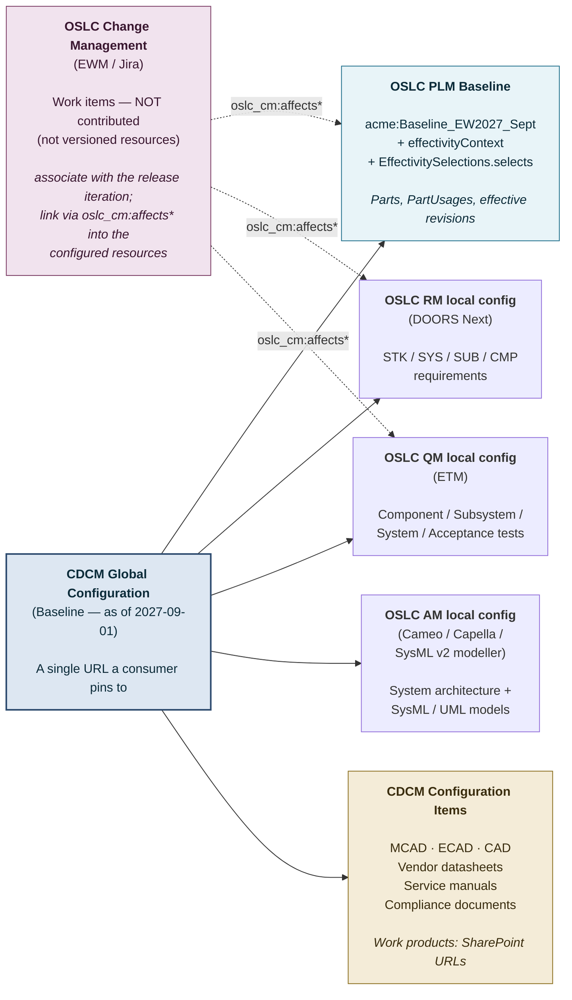

# Acme EcoWash: a digital thread example with OSLC PLM and CDCM

*An OSLC-based digital thread for a realistic washing-machine product. The OSLC PLM provider owns Parts, PartUsages, and effectivity-bound BOM resolution. CDCM (Cross-Domain Configuration Management) aggregates the PLM Baseline alongside requirements, tests, architecture models, and engineering documents (CAD / MCAD / ECAD) into a single cross-domain Global Configuration. Change requests, which are not versioned resources, link into the configured resources rather than being contributed as a configuration. CDCM's Configuration Items for documents reference work-product storage in SharePoint.*

*Variability is deferred to a future revision; this example exercises versions and effectivity only. For the analytical comparison of this pattern against three alternative mapping approaches (Teamcenter alone, OSLC PLM alone, CDCM alone), see [`acme-ecowash-digital-thread-exploration.md`](acme-ecowash-digital-thread-exploration.md).*

## At a glance

A complete digital thread for the Acme EcoWash 2027 washing machine spans three roles:

1. **OSLC PLM** — with the proposed [`oslc_plm:EffectivitySelections`](../plm-spec.html) extension — owns Parts, PartUsages, and the effectivity-bound BOM. A Baseline carries the configuration as of a specific date.
2. **OSLC Requirements Management / Quality Management / Architecture Management** own their respective domain content — requirements, test cases, architecture (UML and SysML v2) models — each as standard OSLC resources in their own tools, each contributed through its own local configuration. **OSLC Change Management** participates differently: change requests are *not* versioned resources, so they are not contributed as a configuration; instead the change-management tool (EWM, Jira) associates its work items with the release iteration and links them (`oslc_cm:affects*`) into the configured versioned resources.
3. **CDCM** is the **Global Configuration aggregator**: it composes the OSLC PLM Baseline, the other OSLC tools' local configurations, *and* its own typed Configuration Items for organizational documents (CAD / MCAD / ECAD, vendor datasheets, compliance documents, service manuals) whose work products live in SharePoint.

The Global Configuration is a single URL a downstream consumer pins to. When asked *"what is in EcoWash 2027 as of 2027-09-01?"*, the consumer reads CDCM's flat list of contributions, then each contributing tool resolves its own concept URIs to version URIs against its own contribution.

## The product

Acme Appliances designs and ships the Acme EcoWash 2027 Eco Line, a residential washing machine. Acme owns the overall product design; several subsystems are sourced from third parties. The most architecturally interesting third-party part is an OEM Android tablet from TabletCo that runs an Acme-developed Controller App as its boot-up application — a "vendor hardware + vendor software" composite that exercises effectivity on both the tablet revision and the app version.

```
Acme EcoWash 2027 Eco Line
├── Frame
│   ├── Upper Housing       (Acme MCAD)
│   └── Lower Housing       (Acme MCAD)
├── Drum Assembly
│   ├── Drum                (Acme MCAD)
│   └── Bearing             (sourced)
├── Drive System
│   ├── Motor               (sourced from MotorCo)
│   ├── Belt
│   └── Pulley
├── Water Path
│   ├── Inlet Valve         (sourced)
│   ├── Drain Pump          (sourced)
│   └── Hose Set            (Acme ECAD/MCAD)
└── Control System
    ├── Tablet              (OEM from TabletCo, T-10-IND)
    ├── Tablet Mount Bracket (Acme MCAD)
    ├── EcoWash Controller App (Acme software, auto-starts on boot)
    └── Wiring Harness      (Acme ECAD)
```

Sourced parts (Motor, Bearing, Inlet Valve, Drain Pump, Tablet) have their own internal BOMs at the vendor. From Acme's perspective each is a single Part with a vendor reference and a revision identifier that tracks the vendor's revision; the vendor's internal BOM is out of scope.

Selected production effectivity dates used in this example:

| Part / PartUsage | Version | Effective |
|---|---|---|
| `Motor` | V12.8 | until 2027-06-30 |
| `Motor` | V12.9 | from 2027-07-01 |
| `Housing` | V4.2 | 2027-01-01 to 2027-12-31 |
| `Tablet` | T-10-IND rev A | until 2027-04-30 |
| `Tablet` | T-10-IND rev B | from 2027-05-01 |
| `EcoWash Controller App` | v3.1 | 2027-01-01 to 2027-06-30 |
| `EcoWash Controller App` | v3.2 | from 2027-07-01 |

## The OSLC PLM side — Parts, PartUsages, and effectivity

Every part is an `oslc_plm:Part` (a concept resource); each part has version resources (revisions); each parent→child usage in the BOM is reified as an `oslc_plm:PartUsage` whose versions carry `oslc_plm:effectivity` records.

The effective BOM at a given date is a Baseline whose `oslc_plm:effectivityContext` is frozen at that date and whose `oslc_plm:EffectivitySelections.selects` names the specific PartUsage versions that survived effectivity evaluation. For the 2027-09-01 snapshot:

```turtle
@prefix oslc:        <http://open-services.net/ns/core#> .
@prefix oslc_config: <http://open-services.net/ns/config#> .
@prefix oslc_plm:    <http://open-services.net/ns/plm#> .
@prefix dcterms:     <http://purl.org/dc/terms/> .
@prefix xsd:         <http://www.w3.org/2001/XMLSchema#> .
@prefix acme:        <https://plm.acme.example/ecowash/> .

acme:WashingMachine    a oslc_plm:Part ; dcterms:title "Acme EcoWash 2027 Eco Line" .
acme:Motor             a oslc_plm:Part ; dcterms:title "Motor (MotorCo M-87)" .
acme:Tablet            a oslc_plm:Part ;
    dcterms:title "Tablet (TabletCo T-10-IND)" ;
    dcterms:identifier "ACME-CTRL-TAB-001" ;
    oslc:publisher <https://tabletco.example/> .
acme:ControllerApp     a oslc_plm:Part ; dcterms:title "EcoWash Controller App" .
# (Housing, Drum, etc. — same pattern, omitted for brevity)

# Each PartUsage version pins a specific child Part version and carries effectivity:
acme:Usage_WM_Motor_27on a oslc_config:VersionResource , oslc_plm:PartUsage ;
    oslc_plm:effectivity [
        a oslc_plm:Effectivity ;
        oslc_plm:effectiveValueType oslc_plm:Date ;
        oslc_plm:effectiveFrom "2027-07-01"^^xsd:date
    ] .

# The Baseline freezes the effective BOM at 2027-09-01:
acme:Baseline_EW2027_Sept a oslc_config:Baseline ;
    dcterms:title "EcoWash 2027 — as of 2027-09-01 (Manufacturing release)" ;
    oslc_config:component         acme:WashingMachine ;
    oslc_plm:effectivityContext   acme:Ctx_2027_09_01 ;       # frozen
    oslc_config:selections        acme:Selections_2027_09_01 .

acme:Ctx_2027_09_01 a oslc_plm:EffectivityContext ;
    oslc_plm:effectivityDate "2027-09-01"^^xsd:date .

acme:Selections_2027_09_01 a oslc_plm:EffectivitySelections ;
    oslc_config:selects
        acme:Usage_WM_Motor_27on ,          # Motor V12.9 (effective from 2027-07-01) ✓
        acme:Usage_WM_Housing_2027 ,        # Housing V4.2 ✓
        acme:Usage_WM_Tablet_revB ,         # Tablet rev B (effective from 2027-05-01) ✓
        acme:Usage_WM_App_v3-2 .            # Controller App v3.2 (effective from 2027-07-01) ✓
```

The Baseline URL `acme:Baseline_EW2027_Sept` is the OSLC PLM-side configuration URL that a downstream consumer pins to. Reading it yields both the post-filter selects (the effective Part / PartUsage versions) and the `effectivityContext` reference that produced them — a complete audit trail of the configuration with no external lookup required.

## The CDCM side — Global Configuration aggregating contributions

CDCM is the cross-domain Global Configuration aggregator. It is a conformant OSLC Configuration Management Global Configuration provider — it composes contributions from multiple applications into a single Global Configuration that downstream consumers pin to — and it adds two organizational capabilities on top.

### Two kinds of contribution in a CDCM Global Configuration

A Contribution in CDCM points at one of two kinds of target:

1. **An external OSLC local configuration.** The Contribution references another tool's local-configuration URL — the OSLC PLM Baseline, a DOORS Next module configuration, an ETM test-plan configuration, an AM provider's model configuration. The owning tool resolves *its own* concept URIs against *its own* local configuration when a consumer asks; CDCM does not know or need to know the owning tool's internal version-resolution. (Change-management tools are the exception: change requests are not versioned resources, so EWM / Jira do not contribute a configuration here — their work items instead associate with the release iteration and link into the configured versioned resources via `oslc_cm:affects*`.)

2. **A CDCM-internal Configuration Item.** The Configuration Item is a typed CDCM resource whose **work product** is a non-OSLC URL — for this example, a SharePoint document URL. CDCM's typed Configuration Item carries Acme-defined properties (drawing number, revision, lifecycle state, authorization, owner) and lifecycle behaviour; the underlying file content is unchanged in SharePoint.

The flat list a downstream consumer reads from CDCM mixes both kinds of contribution. Each entry tells the consumer either *"here is another tool's local configuration to resolve against"* (case 1) or *"here is the CDCM Configuration Item whose work product is the document you want, available at this SharePoint URL"* (case 2).

### The Global Configuration for EcoWash 2027 (as of 2027-09-01)

```
Global Configuration: EcoWash 2027 — as of 2027-09-01 (CDCM Baseline)
│
├─ [Contributions whose target is an external OSLC local configuration]
│  │
│  ├── OSLC PLM Baseline:        acme:Baseline_EW2027_Sept
│  │       (carries oslc_plm:effectivityContext + EffectivitySelections.selects
│  │        → the effective Part / PartUsage versions for 2027-09-01)
│  ├── OSLC RM local config:     EW2027-Requirements-Sept
│  │       (DOORS Next: STK-* / SYS-* / SUB-* / CMP-* requirements at this snapshot)
│  ├── OSLC QM local config:     EW2027-Tests-Sept
│  │       (ETM: component / subsystem / system / acceptance tests for this release)
│  └── OSLC AM local config:     EW2027-Models-Sept
│          (architecture models — SysML v2 / UML — versioned with the release)
│
│  (Change requests are NOT contributed here — they are not versioned resources.
│   EWM / Jira work items associate with this release iteration and link via
│   oslc_cm:affects* into the configured versioned resources above.)
│
└─ [Contributions whose target is a CDCM Configuration Item; work products in SharePoint]
   │
   ├── CI «MCAD Document»  EcoWash 2027 — Full MCAD Assembly (rev D)
   │       work product: https://acme.sharepoint.com/sites/EcoWash2027/MCAD/Full-Assembly-rev-D.SLDASM
   ├── CI «MCAD Document»  Upper Housing — MCAD Model (rev 12)
   │       work product: https://acme.sharepoint.com/sites/EcoWash2027/MCAD/Upper-Housing-rev-12.SLDPRT
   ├── CI «MCAD Document»  Lower Housing — MCAD Model (rev 11)
   │       work product: https://acme.sharepoint.com/sites/EcoWash2027/MCAD/Lower-Housing-rev-11.SLDPRT
   ├── CI «ECAD Document»  Wiring Harness — Schematic (rev 5)
   │       work product: https://acme.sharepoint.com/sites/EcoWash2027/ECAD/Harness-rev-5.dsn
   ├── CI «ECAD Document»  Wiring Harness — Connector List (rev 5)
   │       work product: https://acme.sharepoint.com/sites/EcoWash2027/ECAD/Harness-Connectors-rev-5.xlsx
   ├── CI «CAD Document»   Tablet Mount Bracket — Drawing (rev 3)
   │       work product: https://acme.sharepoint.com/sites/EcoWash2027/CAD/Bracket-rev-3.pdf
   ├── CI «Vendor Datasheet» TabletCo T-10-IND — Datasheet (rev B)
   │       work product: https://acme.sharepoint.com/sites/EcoWash2027/Vendor/TabletCo-T-10-IND-revB.pdf
   ├── CI «Vendor Datasheet» MotorCo M-87 — Datasheet (V12.9)
   │       work product: https://acme.sharepoint.com/sites/EcoWash2027/Vendor/MotorCo-M-87-V12-9.pdf
   ├── CI «Service Manual»   EcoWash 2027 — Service Manual (rev 1.2)
   │       work product: https://acme.sharepoint.com/sites/EcoWash2027/Manuals/Service-rev-1.2.pdf
   └── CI «Compliance Document» UL Listing Report (issued 2027-08-15)
           work product: https://acme.sharepoint.com/sites/EcoWash2027/Compliance/UL-Listing-2027-08-15.pdf
```

### CDCM Configuration Item types used in this example

Acme's CDCM administrator defines each Configuration Item type with its own property schema, editor view, lifecycle, and authorization rules. None of these properties affect the OSLC layer — they are CDCM-internal, and an OSLC consumer sees only the type, the CDCM properties it cares about, and the work-product URL.

| CI type | Indicative CDCM properties | Work product location |
|---|---|---|
| `MCAD Document` | drawing number, revision, CAD format, owner, lifecycle state | SharePoint, in `EcoWash2027/MCAD/` |
| `ECAD Document` | schematic name, revision, sheet count, ECAD tool | SharePoint, in `EcoWash2027/ECAD/` |
| `CAD Document` | drawing number, revision, format (PDF / DWG) | SharePoint, in `EcoWash2027/CAD/` |
| `Vendor Datasheet` | vendor, vendor part number, vendor revision, language | SharePoint, in `EcoWash2027/Vendor/` |
| `Service Manual` | revision, target audience, language, page count | SharePoint, in `EcoWash2027/Manuals/` |
| `Compliance Document` | issuing body, certificate id, issue date, expiry date | SharePoint, in `EcoWash2027/Compliance/` |

The Configuration Items appear in CDCM's typed editors and lifecycle workflows; the underlying files (`.SLDASM`, `.dsn`, `.pdf`, etc.) are checked into SharePoint with SharePoint's native versioning. Each CI carries a `workProduct` URL pointing at the SharePoint location; the CI itself is what's contributed into the Global Configuration.

## What a consumer sees

A downstream consumer that wants *"EcoWash 2027 as of 2027-09-01"* pins their request to the CDCM Global Configuration baseline URL. They then walk the flat, ordered list of contributions (standard OSLC Configuration Management Global Configuration semantics — a Global Configuration aggregates contributions, and each application resolves concept URIs against the local configuration it owns in that aggregation):

- For each **external OSLC contribution**, the consumer asks the owning tool to resolve the concept URI of interest against the named local configuration. The PLM Baseline yields the effective Part / PartUsage versions; DOORS Next yields the requirement versions; ETM yields the test-case versions; the AM provider yields the architecture-model versions.
- For each **CDCM Configuration Item contribution**, the consumer reads the CI's CDCM properties (drawing number, revision, lifecycle state, …) and follows the work-product URL to fetch the actual file from SharePoint.
- **Change requests** are reached the other way around: they are not contributed as a configuration, so the consumer does not resolve them against a local configuration. Instead the change-management tool (EWM, Jira) associates its work items with this release iteration, and the work items carry `oslc_cm:affects*` links into the configured versioned resources above — so a consumer that has resolved a Part / requirement / test version can follow those links to find the change requests driving its next revision.

Acme's PLM team gets the effectivity-bound BOM directly from the OSLC PLM Baseline. The downstream engineering team gets the matching CAD / MCAD / ECAD documents from CDCM. Manufacturing release, regulatory audit, and field service all use the same Global Configuration URL to ensure they are looking at exactly the same configuration of the product.

## V-model traces across the digital thread

Cross-domain links between resources use standard OSLC link properties:

- **Requirement → Part**: `oslc:satisfiedBy` (a `oslc_rm:Requirement` is satisfied by an `oslc_plm:Part` or PartUsage version).
- **Test case → Requirement**: `oslc_qm:validatesRequirement`.
- **Test case → Part**: `oslc_qm:validatesPart`, `oslc_qm:validatesPartUsage`.
- **Change request → Part / Requirement / Test case**: `oslc_cm:affectsPart`, `oslc_cm:affectsRequirement`, `oslc_cm:affectsTestCase`.
- **Architecture element → Part**: `oslc_am:realizes` (an `oslc_am:Resource` — for example a SysML PartDefinition exposed via the OASIS OSLC SysML v2 vocabulary — realizes an `oslc_plm:Part`, per the OSLC PLM specification's *Constraints on Other OSLC Domain Resources*).

Each link is a normal OSLC property on a normal OSLC resource. The link properties are followed within each tool against that tool's local configuration in the active Global Configuration — the same Global Configuration URL the consumer originally pinned to.



## Variability — deferred

This example exercises versions and effectivity only. Adding variability — selecting which option-conditional content applies for a particular Capacity / Market / Trim configuration — uses the same Global Configuration / Contribution machinery, with an additional `oslc:VariabilitySelections` resource attached to each contributing local configuration (per the [OSLC Variability specification](../../core/oslc-variability-spec.html)). The CDCM aggregator carries variability selections through transparently; the PLM provider resolves them against PartUsage variant conditions; the architecture and requirements providers resolve them against their own variant-conditional content. A future revision of this example will exercise variability against the same product structure.

## Cross-references

- [`acme-ecowash-digital-thread-exploration.md`](acme-ecowash-digital-thread-exploration.md) — the analytical companion document. It compares the recommended hybrid pattern (this document) against three alternative mapping approaches (Teamcenter alone, OSLC PLM alone, CDCM alone) and works through what each captures and loses. Read it for the *why*; this document is the *what*.
- [`oslc-teamcenter-plm-mapping.md`](oslc-teamcenter-plm-mapping.md) — the three-mapping analysis that recommends this hybrid as Mapping 3.
- [`oslc-cm-sysml-teamcenter.md`](oslc-cm-sysml-teamcenter.md) — the conceptual frame for *why* selection and definition are kept separate, and *why* the proposed subclassing alternative does not work.
- [OSLC PLM specification](../plm-spec.html) — the normative spec for Parts, PartUsages, Effectivity, EffectivityContext, EffectivitySelections, and the `effectivityContext` property on Configuration.
- [OSLC Variability specification](../../core/oslc-variability-spec.html) — the variability extension (deferred in this example).
- OSLC Configuration Management — Global Configurations, contributions, and the flattened contribution list that consumers use to resolve concept URIs to version URIs. The CDCM behaviour described here (a Global Configuration whose contributions are a mix of external OSLC local configurations and CDCM-internal Configuration Items) is an application of these standard Global Configuration mechanisms.
